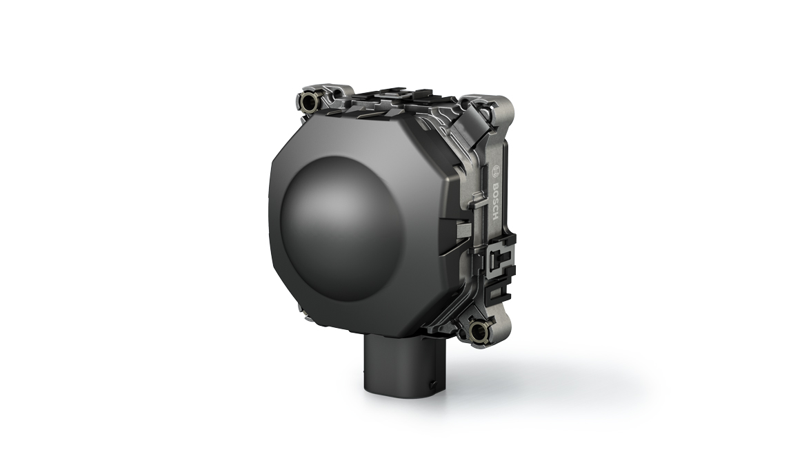

# RADAR - FMCW & CSM



[Image source](https://www.bosch-mobility-solutions.de/de/produkte-und-services/pkw-und-leichte-nutzfahrzeuge/fahrerassistenzsysteme/linksabbiegeassistent/fernbereichsradarsensor/)

## Contents

This repo explains the theoretical fundamentals of velocity and range estimation for autonomous driving and driver assistance systems.

1. [Discrete Fourier Transform](./DFT.ipynb)
2. [FMCW & Chirp Sequence Modulation](./RADAR.ipynb)

You need good understanding of DFTs in order to understand the mechanics of Chirp Sequence Modulation. Feel free to go through the DFT notebook.

## Set up

```shell
pip install -r requirements.txt
```

## License

MIT